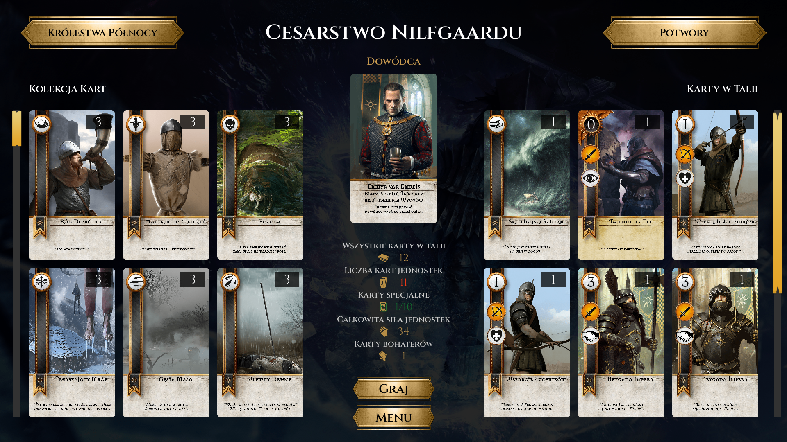
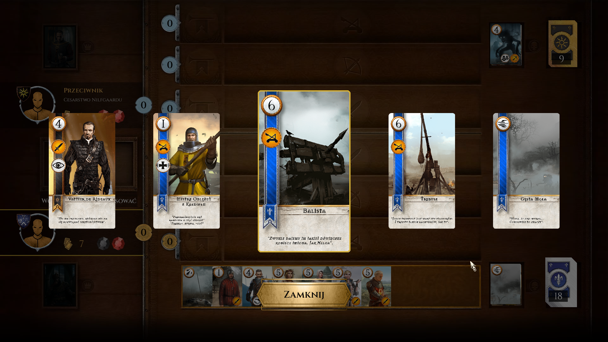

# Gwent

## Overview

**Gwent** is a standalone implementation of *The Witcher 3* minigame.  
The project started as a student assignment and has since been further developed.  

All graphics and concept rights belong to the original creators of Gwent – **CD PROJEKT RED**.  
This project is a non-commercial fan-made recreation.

---

## Features
### Mechanics
Based on *The Witcher 3*, we aimed to recreate the game’s core mechanics and overall feeling as closely as possible. That being said, some elements may differ from the original — most of these changes are intentional.

The game also includes a deck-building screen, where you can switch between factions and save custom decks.

### Multiplayer
The main distinguishing feature we introduced from the very beginning is the multiplayer mode, which was not available in the original Witcher release. The game provides separate client and server executables, with the client connecting to an opponent by entering the server’s IP address and a custom lobby code in the settings screen.

### Cards
The game includes all cards from the base release as well as the DLC expansions.
In addition, two new custom factions have been added: the Duchy of Toussaint and the Cult of the Eternal Fire, each featuring unique cards and abilities. Skellige’s commander roster has been expanded to five, bringing it in line with the other factions.  

### Customisation
The settings screen allows players to choose an application theme, adjust the music volume, and change the language. Currently, Polish (PL) and English (EN) are supported.

## Screenshots

 

## Technologies
- **Python 3.13**
- **Pygame** – graphical interface
- **Pickle, sockets** – client-server communication
- **Threading** – asynchronous View–Presenter layer and multithreaded server